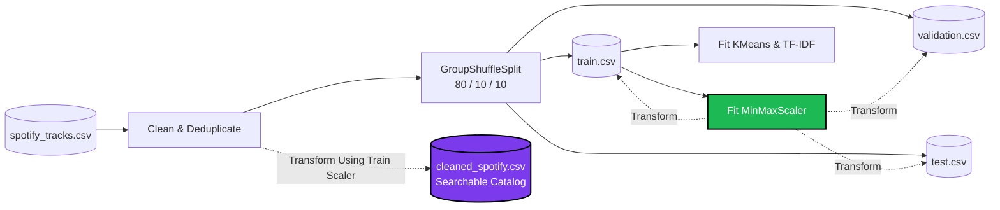

# 🎵 SoundScout: Spotify Song Recommendation System

SoundScout is a robust, production-ready music recommendation platform that pairs an intelligent Python AI backend with a modern, polished React frontend. 

Rather than relying on closed-box collaborative filtering, this system transparently analyzes **structural audio features** (e.g., danceability, energy, tempo, valence), **genre profiles**, and **collaboration graphs** to discover music based on its intrinsic acoustic DNA and cultural footprint.

---

## ✨ Features

- **Five Recommendation Engines**: Pick your preferred discovery approach, ranging from raw acoustic similarity to complex hybrid algorithms.
- **Smart Song Resolution**: Automatically resolves song queries deterministically, prioritizing exact title matches, matching optional artist queries, and sorting duplicate names by popularity (e.g., retrieving The Weeknd's "Blinding Lights" over a Kidz Bop cover).
- **Leak-Free ML Pipeline**: Engineered with rigorous machine learning practices. The scaler and training matrices are strictly fitted on the training split, completely preventing data leakage into validation or the searchable recommendation catalog.
- **Modern React Interface**: Beautiful, responsive music discovery experience. Features live autocomplete search, a functional dark/light theme toggle, deterministic dynamic gradient artwork, and animated result rankings.
- **High-Performance FastAPI**: Implements a `lifespan` manager to load machine learning models directly into memory upon server startup, enabling instantaneous API responses. Missing models are automatically and rapidly regenerated on the fly.

---

## 🏗️ System Architecture

```mermaid
flowchart TD
    %% Frontend Subgraph
    subgraph Frontend [React Frontend (Vite)]
        UI[User Interface]
        State[React State & Theme Context]
        API_Client[Fetch API Adapter]
    end

    %% Backend Subgraph
    subgraph Backend [FastAPI Backend]
        API_Router[FastAPI Router\n/recommend, /search]
        EngineMgr[Lifespan Context Manager\nLoads models to memory]
        
        subgraph Recommendation Engines
            Hybrid[Weighted Hybrid Engine]
            Content[Content-Based (Audio) Engine]
            Artist[Artist Similarity Engine]
            Genre[Genre-Based Engine]
            Mood[Mood-Based Engine]
        end
        
        Lookup[Song Resolution Logic]
    end

    %% Storage Subgraph
    subgraph Storage [Local Storage]
        Models[(Serialized ML Models\n*.pkl)]
        Catalog[(Searchable Catalog\ncleaned_spotify.csv)]
        Eval[(Train/Val/Test Splits\ntrain.csv etc.)]
    end

    UI <--> |Input / Render| State
    State <--> |JSON Payload| API_Client
    API_Client <-->|HTTP POST /recommend| API_Router
    
    API_Router <--> |Query & Filters| Lookup
    Lookup --> |Resolved Song DataFrame| Recommendation Engines
    EngineMgr -.-> |Preloads| Recommendation Engines
    Recommendation Engines <--> |Reads| Catalog
    EngineMgr <--> |Deserializes / Regenerates| Models
    Models -.-> |Fitted on| Eval
```

---

## 🧠 Recommendation Engines

The system provides five distinct discovery methods, encapsulated as separate engine classes in the Python backend:

### 1. Weighted Hybrid Recommendation (`WeightedRecommender`)
The flagship algorithm. It computes an ensemble score combining multiple independent signals to produce highly coherent, high-quality recommendations. The weights are implemented as follows:
- **Audio Similarity (40%)**: Cosine similarity across scaled acoustic features.
- **Artist Similarity (20%)**: TF-IDF token overlap between artist collaboration credits.
- **Genre Profile Similarity (15%)**: Cosine similarity of the song's genre against the catalog's average audio profiles.
- **K-Means Cluster Match (15%)**: A binary boost applied if the candidate song falls into the same acoustic K-Means cluster.
- **Popularity Score (10%)**: A normalized global popularity scale.

### 2. Content-Based Audio Similarity (`ContentBasedRecommender`)
Computes pure acoustic cosine similarity across 10 scaled structural audio features (e.g., energy, tempo, acousticness, instrumentalness). It occasionally surfaces cross-genre matches because it prioritizes structural sound (e.g., a high-tempo pop song might match a drum-and-bass track with identical BPM and energy).

### 3. Genre-Based Recommendation (`GenreRecommender`)
A constrained search that filters the catalog to match the input song's exact genre, and then ranks the remaining tracks by content-based audio similarity.

### 4. Artist Similarity (`ArtistSimilarityRecommender`)
Rather than relying on musical similarity, this engine tokenizes the `artists` string using a TF-IDF vectorizer and calculates cosine similarity across the vocabulary space. This successfully captures shared collaboration graphs (e.g., discovering producers and featured vocalists associated with the target artist).

### 5. Mood-Based Recommendation (`MoodRecommender`)
A fast, rule-based heuristic classification system that does not require an input song. Users select a target mood, and the system filters the catalog based on pre-defined audio signatures, returning the most popular matches:
- **Party**: `energy > 0.65` AND `tempo > 0.55`
- **Chill**: `energy < 0.40` AND `tempo < 0.45`
- **Happy**: `valence > 0.50`
- **Sad**: Remaining catalog space.

---

## 🔍 Song Resolution Strategy

When a user searches for a song like `"Blinding Lights"`, the `src/song_lookup.py` engine resolves the query deterministically to a single track row using this exact sequence:

1. **Text Normalization**: Strips punctuation, trims whitespace, and converts to lowercase.
2. **Title Matching**: Exact normalized title matches are prioritized; if none are found, it falls back to a substring "contains" match. *(Note: True fuzzy string distance matching is not implemented).*
3. **Artist Filtering**: If an artist is provided, exact artist token matches (score 2) outrank partial collaboration matches (score 1). Non-matching artists are explicitly excluded.
4. **Popularity Tie-Breaking**: Sorts duplicate tracks descending by global popularity to avoid returning obscure covers.
5. **Stable Fallback**: Uses `track_id` ascending as a final tie-breaker to prevent dataframe row-order dependence.

---

## 🗃️ Data Pipeline & Separation of Concerns



### Recommendation Catalog vs. Evaluation Data
A critical architectural decision in this project is the separation of the **Evaluation Data** and the **Searchable Recommendation Catalog**.

1. **Leak-Free Preprocessing**: The `MinMaxScaler`, TF-IDF vocabulary, and K-Means clusters are fitted **strictly on the 80% training partition** (`train.csv`). To prevent data leakage, we utilize a `GroupShuffleSplit` over a composite key (`base_title + normalized_artists`) so acoustic versions, remixes, and live performances of the same song are forced into the same partition.
2. **The Searchable Catalog**: After the models are fitted on the training split, they are used to transform the *entire deduplicated dataset*, which is saved as `cleaned_spotify.csv`. 
3. **Inference**: The recommendation API queries the complete catalog (`cleaned_spotify.csv`) at inference time. This allows users to search for *any* song in the real-world dataset without being artificially restricted to tracks that happened to land in the 80% training partition, while maintaining mathematical integrity.

---

## 🚀 Quick Start Guide

### 1. Start the Python API (Backend)
The backend requires Python 3.8+ and runs on FastAPI.

```powershell
# Navigate to the backend directory
cd backend

# Create and activate a virtual environment
python -m venv .venv
.\.venv\Scripts\Activate.ps1   # Windows
# source .venv/bin/activate    # Mac/Linux

# Install dependencies
pip install -r requirements.txt

# Start the API server
uvicorn src.api:app --reload --port 8000
```
*Note: Large machine learning models (`.pkl`) are ignored in Git. When you boot the API for the first time, it will automatically regenerate the models from the dataset in ~2 seconds.*

### 2. Start the React UI (Frontend)
The frontend requires Node.js and npm. Open a **new terminal window**:

```powershell
# Navigate to the frontend directory
cd frontend

# Install dependencies
npm install

# Start the Vite development server
npm run dev
```
Open `http://localhost:5173` in your browser to experience SoundScout.

---

## 🧪 Testing

The backend includes a comprehensive, 18-test automated Pytest suite covering all five engines, API request validation, duplicate result checking, and the autocomplete `/search` endpoint.

```powershell
cd backend
.\.venv\Scripts\Activate.ps1
pytest tests/test_api.py -v
```

---

## 💻 Technology Stack

**Frontend**: React 19, Vite, Vanilla CSS (Custom Properties / CSS Variables)
**Backend**: Python, FastAPI, Uvicorn, Pytest, HTTPX
**Data & ML**: Pandas, NumPy, Scikit-Learn (Cosine Similarity, TF-IDF, K-Means, MinMaxScaler)

---

## ⚠️ Known Limitations & Future Work

- **No External Artwork**: Because the project does not integrate with an external music provider's API for images, it renders beautiful CSS gradients deterministically based on track names as visual fallbacks.
- **Collaborative Filtering**: The system does not possess user-item interaction histories (listening behavior), and thus relies purely on content-based structural features.
- **Artist Similarity Mechanism**: Artist similarity measures textual and collaborative overlap via TF-IDF over credited names, rather than analyzing inherent acoustic similarities between two musicians' complete discographies.
